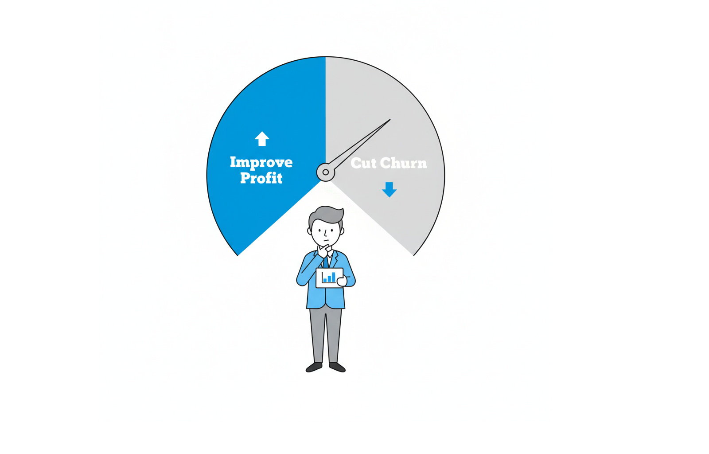

# Daniel’s Data Portfolio

*A data analysis portfolio showcasing projects in Python, SQL, and visualization.*

  
  
  
  
  
  

---

## Table of Contents

* [Overview](#overview)
* [Tech Stack](#tech-stack)
* [Projects](#projects)

  * [Data Engineering](#data-engineering)
  * [Python: Data Analysis and Machine Learning](#python-data-analysis-and-machine-learning)
  * [Business Intelligence Dashboards](#business-intelligence-dashboards)
  * [SQL Projects](#sql-projects)
* [Certifications](#certifications)
* [Contact](#contact)

---

## Overview

This portfolio highlights practical, end‑to‑end work across data engineering, analysis, visualization, and machine learning. Each project includes an at‑a‑glance description, the tools used, and a **clickable thumbnail** preview.

---

## Tech Stack

**Languages:** Python, SQL
**Libraries:** Pandas, NumPy, Matplotlib, Plotly, Scikit‑learn
**BI & Apps:** Power BI

---

## Projects

### Business Intelligence & SQL Projects

### [Northwind Business Insights (Sales & Operations Analytics)](https://github.com/naesadaniel88-cmd/Northwind-Business-Insights)

| Associated           | Tools                | Project Description |
| -------------------- | -------------------- | ------------------- |
| Public Dataset (Northwind) | SQL Server, Power BI | Analyzes transactional sales, customer, product, and shipping data from Northwind to produce a management-ready business insights dashboard. Surfaces top customers and products (Pareto/ABC), margins by category, shipping performance (on-time %, lead times), and retention trends (new vs returning customers). |

---

### [Sales & Margin Performance Insights (Revenue & Profitability Analytics)](https://github.com/naesadaniel88-cmd/Sales-Margin-Performance-Insights)

| Associated           | Tools              | Project Description |
| -------------------- | ------------------ | ------------------- |
| Public Dataset (Department Store Sales) | BigQuery, Power BI | Designed and implemented a complete analytics solution integrating raw retail sales data in BigQuery and delivering insights via Power BI. Focuses on profitability monitoring and goal tracking: revenue vs. targets, gross margin trends, margin variance over time, top/bottom performer breakdowns, and KPI gauges with DAX time intelligence. Equips leadership with executive-level profitability drivers and actionable levers. |

---

### Python: Data Engineering

### [Germany Data-Jobs Market Pulse (HR Analytics)](https://github.com/naesadaniel88-cmd/Germany-Data-Jobs-Market-Pulse-HR-Analytics-)

| Associated           | Tools                                       | Project Description |
| -------------------- | ------------------------------------------- | ------------------- |
| Open API (German Federal Employment Agency) | Python (Jupyter), API Data Import, Power BI | Collect and analyze live job postings from the German Federal Employment Agency to produce a fast market pulse: hotspots by location and employer, roles in demand, weekly cadence, and posting freshness. The HR-practical angle turns raw postings into recruiting moves (where to focus, which roles to promote, how to monitor freshness). |

---

### Python: Data Analysis and Machine Learning

### [E-Commerce — Customer Retention & Value](https://github.com/naesadaniel88-cmd/E-Commerce-Customer-Retention-Value)

| Associated                       | Tools            | Project Description |
| -------------------------------- | ---------------- | ------------------- |
| Kaggle (Brazilian Olist Dataset) | Python (Jupyter) | Explores customer behaviour across orders, payments, reviews, products and sellers. Builds RFM features, review signals, churn flag, and benchmarks models to predict churn risk — translating data into business-ready actions for growth and retention. |

---

## Certifications

<!-- Replace with your real certificates; logos/screenshots welcome. -->
* [**Google Data Analytics Professional Certificate** – Coursera](https://www.coursera.org/account/accomplishments/specialization/certificate/P4AUK0RSC20K)
* [**Certified Data Scientist** – XDi - Experience Design Institut](https://github.com/naesadaniel88-cmd/README.md/blob/main/assets/assets/certifications/XDi_Certified_Data_Scientist_23-501_Daniel_Naesa-min.pdf)

---

## Contact

**Name:** Daniel Naesa
**LinkedIn:** [https://www.linkedin.com/in/your‑profile/](https://www.linkedin.com/in/daniel-naesa-61270092/)

  
  

---
